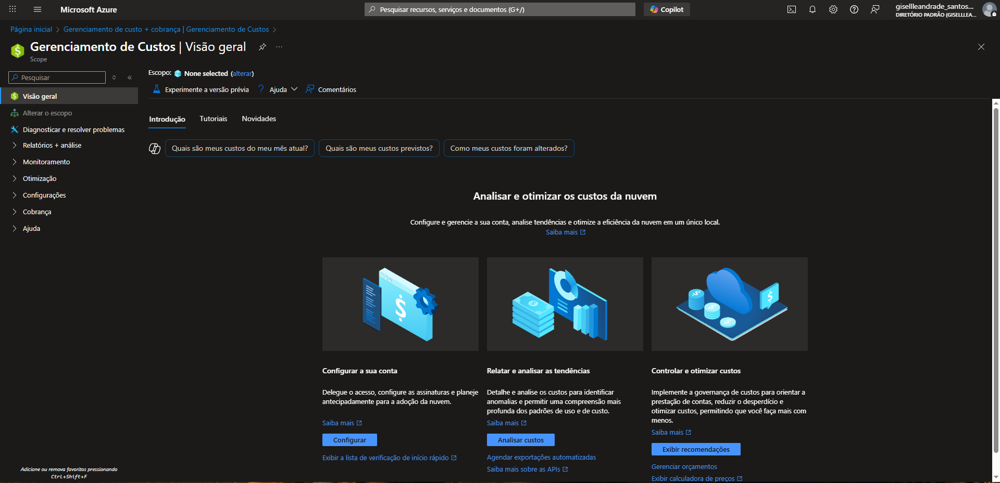
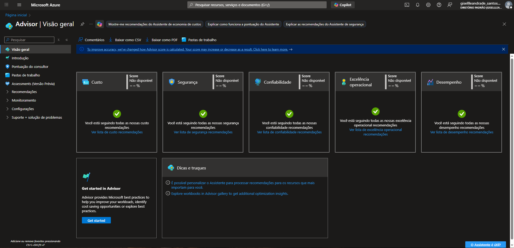
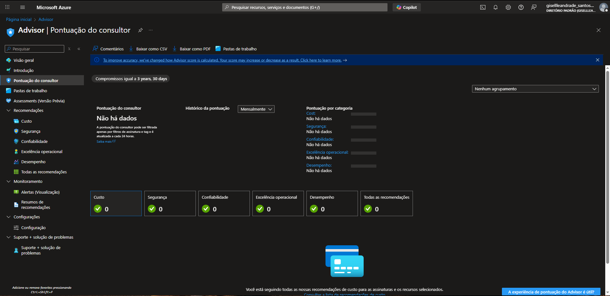

# 📘 Resumo Completo - Microsoft Azure

## 🎯 Temas Abordados

### 1. **Modelos de Computação em Nuvem**
- **IaaS**: Cliente gerencia OS, aplicações, dados
- **PaaS**: Cliente gerencia apenas aplicações e dados  
- **SaaS**: Provedor gerencia tudo, cliente apenas usa

### 2. **CapEx vs OpEx**
- **CapEx**: Investimento inicial alto, propriedade dos recursos
- **OpEx**: Pay-as-you-go, sem investimento inicial, escalabilidade ilimitada

### 3. **Modelo de Responsabilidade Compartilhada**
| Componente | IaaS | PaaS | SaaS |
|------------|------|------|------|
| Dados | Cliente | Cliente | Cliente |
| Aplicações | Cliente | Cliente | Microsoft |
| SO | Cliente | Microsoft | Microsoft |
| Hardware | Microsoft | Microsoft | Microsoft |

### 4. **Componentes de Arquitetura do Azure**
- **Regiões**: 60+ regiões globalmente distribuídas
- **Zonas de Disponibilidade**: 99,99% SLA, proteção contra falhas
- **Pares de Regiões**: Backup automático, mín. 480km de distância
- **Hierarquia**: Grupos de Gerenciamento → Assinaturas → Resource Groups → Recursos

### 5. **Benefícios da Nuvem**
- ⚡ **Escalabilidade**: Recursos sob demanda
- 🌍 **Flexibilidade**: Acesso global 24/7
- 💰 **Economia**: Modelo pay-as-you-use
- 🔒 **Segurança**: Proteção avançada integrada

## 📸 Na Prática - Portal Azure

### Cost Management

- **Análise**: Custos atuais e tendências
- **Previsão**: Estimativas futuras
- **Otimização**: Oportunidades de economia
- **Alertas**: Limites de gastos automáticos

### Azure Advisor  

- **5 Pilares de Otimização**:
  - 💰 Custo - Redução de gastos
  - 🔒 Segurança - Proteção avançada  
  - 🛡️ Confiabilidade - Alta disponibilidade
  - ⚡ Excelência Operacional - Performance
  - 📊 Desempenho - Uso otimizado

### Dashboard de Recomendações

- **Pontuação por Categoria**: 0% em todas (conta nova)
- **Recomendações Inteligentes**: Baseadas em IA
- **Monitoramento Contínuo**: Acompanhamento automático

## 🎯 Exemplos Práticos

### E-commerce - Escolha do Modelo
- **IaaS**: Migração lift-and-shift (controle total)
- **PaaS**: Desenvolvimento ágil (App Service + SQL)  
- **SaaS**: Implementação rápida (Dynamics 365)

### Comparação Financeira
**Tradicional (CapEx)**
- Servidores: $50.000
- Rede: $20.000  
- Data Center: $100.000
- **Total**: $170.000 + manutenção

**Azure (OpEx)**
- Mesma capacidade: $500/mês
- **Total anual**: $6.000
- Escalabilidade incluída ✅

## 🔑 Pontos-Chave
1. **Flexibilidade** é a maior vantagem da nuvem
2. **Responsabilidade compartilhada** varia por modelo
3. **Arquitetura global** garante disponibilidade e compliance
4. **Ferramentas de otimização** (Advisor/Cost Management) são essenciais
5. **Modelo OpEx** transforma CAPEX em custo operacional

## 📋 Checklist de Aprendizado
- [x] Modelos IaaS, PaaS, SaaS
- [x] CapEx vs OpEx
- [x] Responsabilidade compartilhada
- [x] Arquitetura global do Azure
- [x] Benefícios práticos da nuvem
---
> 💡 **Resumo**: Azure oferece flexibilidade, economia e ferramentas inteligentes para otimização contínua de recursos na nuvem!