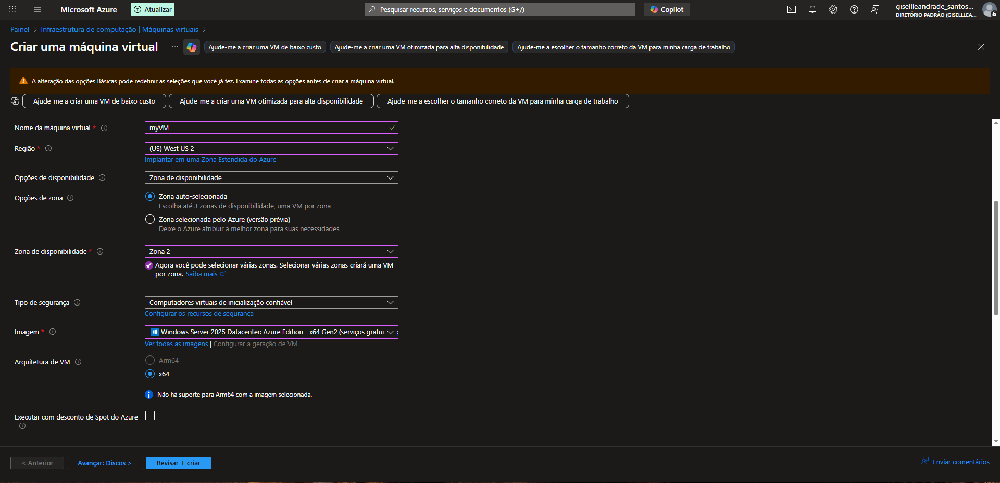
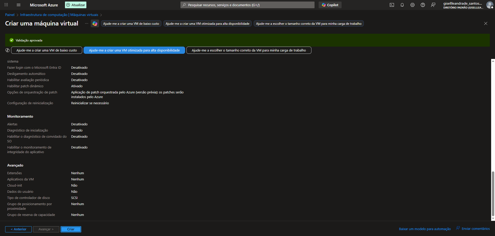
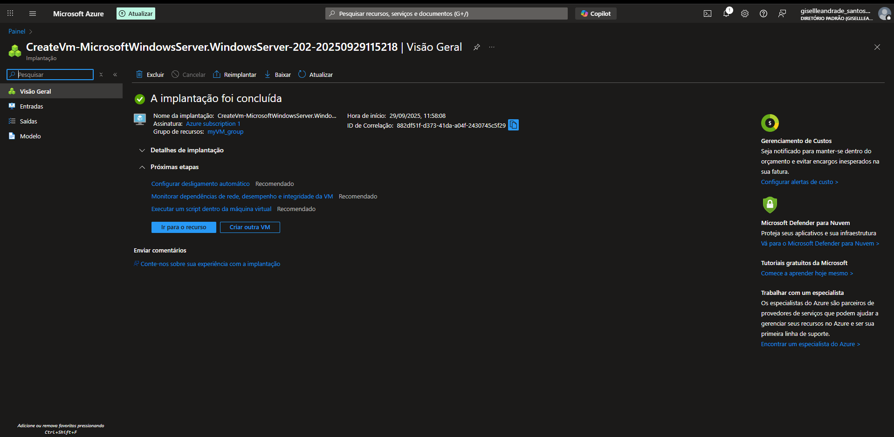
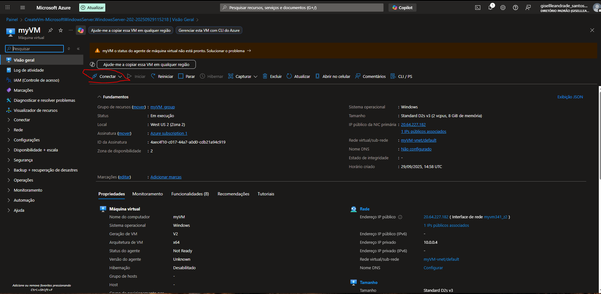
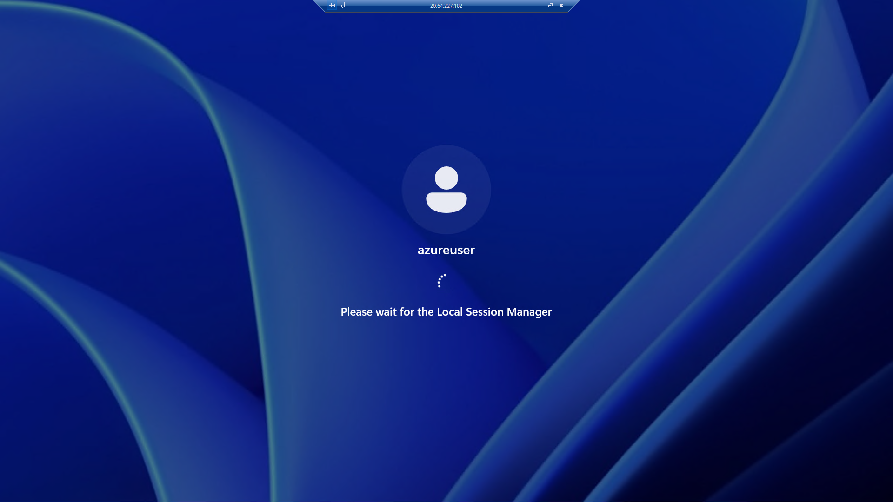
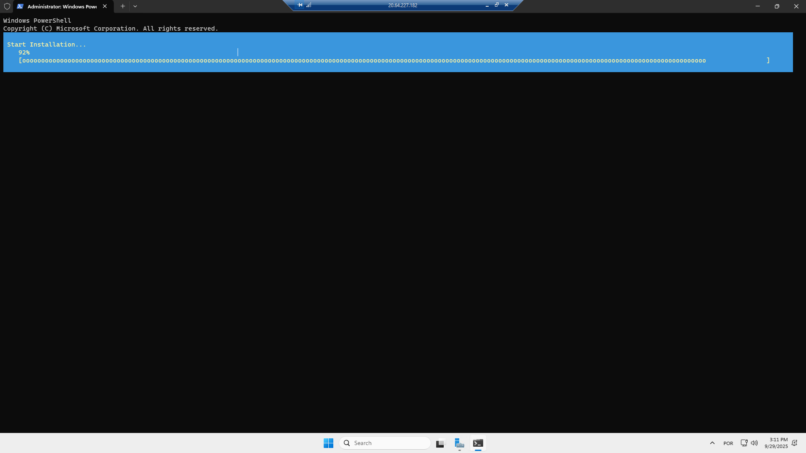
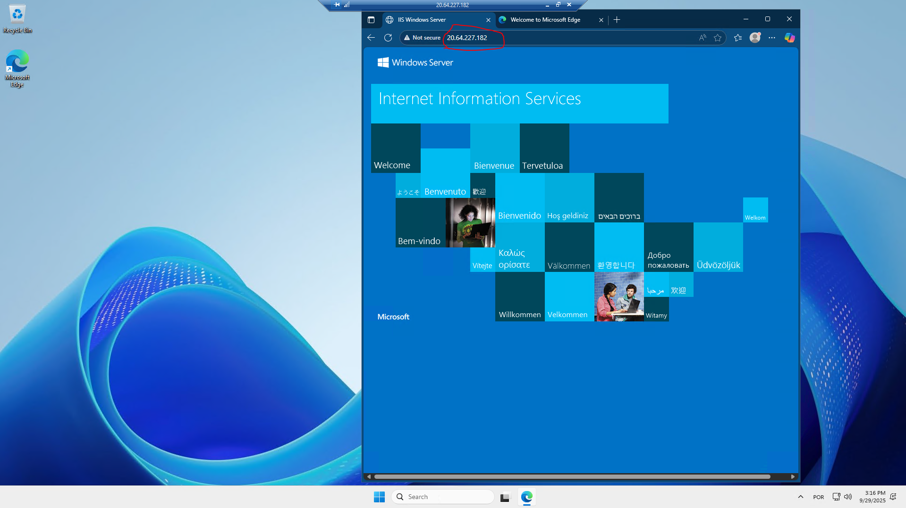
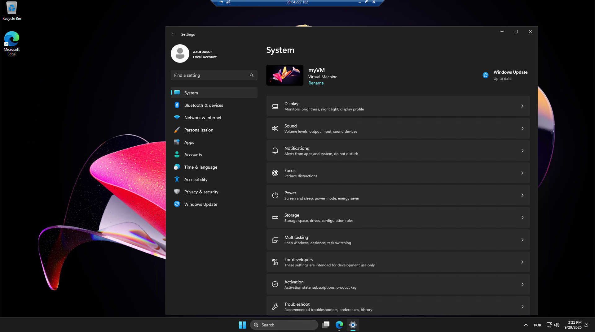
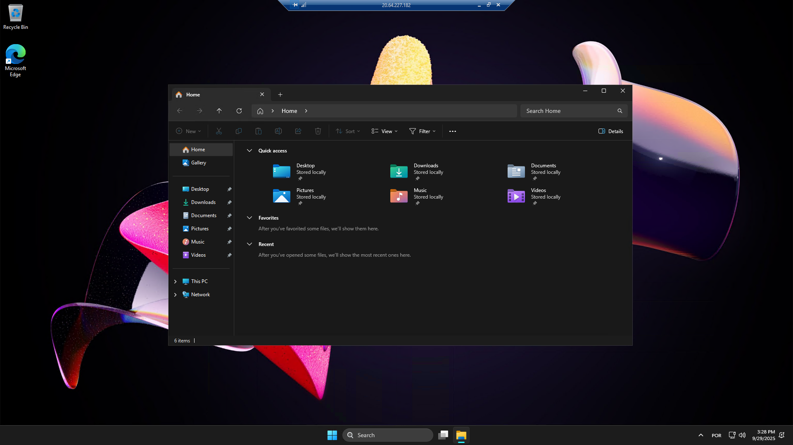
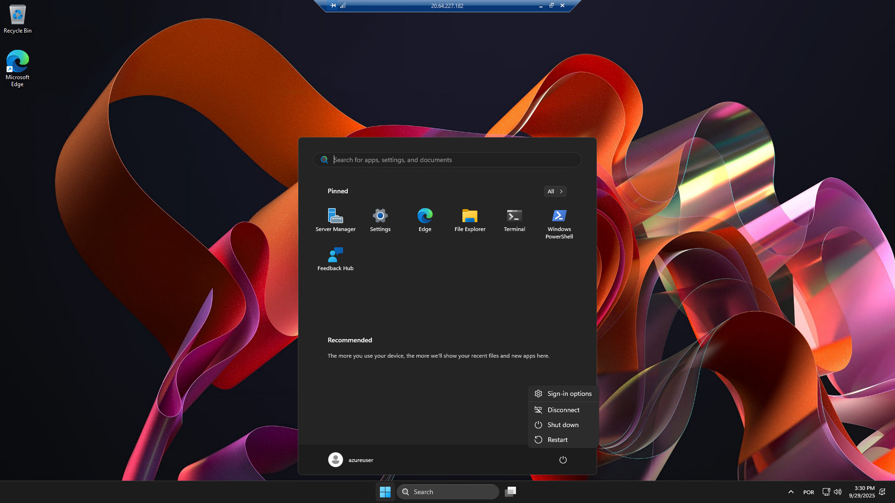

# 🖥️ Criação de Máquina Virtual no Microsoft Azure

## 📋 Sobre o Projeto

Este repositório documenta minha experiência prática com a criação e configuração de uma máquina virtual Windows Server no Microsoft Azure, como parte do desafio de laboratório da **Digital Innovation One (DIO)**.

O objetivo deste projeto foi consolidar conhecimentos sobre:
- Infraestrutura como Serviço (IaaS)
- Provisionamento de recursos no Azure
- Configuração de máquinas virtuais em nuvem
- Gerenciamento de recursos na plataforma Azure

---

## 🎯 Objetivos de Aprendizagem

✅ Aplicar conceitos de computação em nuvem em ambiente prático  
✅ Criar e configurar uma máquina virtual no Azure Portal  
✅ Compreender opções de disponibilidade e zonas de disponibilidade  
✅ Realizar conexão remota via RDP  
✅ Documentar processos técnicos de forma estruturada  

---

## 🔧 Especificações da Máquina Virtual

### Configurações Básicas
- **Nome da VM:** myVM
- **Região:** West US 2 (Zona 2)
- **Imagem:** Windows Server 2025 Datacenter: Azure Edition - x64 Gen2
- **Arquitetura:** x64
- **Tamanho:** Standard D2s v3 (2 vCPUs, 8 GiB de memória)
- **Tipo de Segurança:** Computadores virtuais de inicialização confiável

### Configurações de Rede
- **Endereço IP Público:** 20.64.227.182
- **Rede Virtual:** myVM-vnet/default
- **Grupo de Recursos:** myVM_group

### Autenticação
- **Usuário:** azureuser
- **Tipo de Conta:** Local Account

---

## 📸 Processo de Criação - Passo a Passo

### 1️⃣ Configuração Inicial

Iniciei o processo de criação da VM no Azure Portal, onde configurei:
- Opções de disponibilidade (Zona de disponibilidade 2)
- Monitoramento e alertas (ativados)
- Patch automático e diagnóstico de inicialização

### 2️⃣ Validação e Implantação

A implantação foi concluída com sucesso em **29/09/2025 às 11:58:08 UTC**. O Azure forneceu recomendações de próximas etapas:
- Configurar desligamento automático
- Monitorar dependências de rede
- Executar scripts dentro da máquina virtual

### 3️⃣ Visão Geral da VM

Após a criação, acessei o painel de controle da VM onde pude verificar:
- Status: Em execução
- Sistema operacional: Windows
- Endereço IP público: 20.64.227.182
- Localização: West US 2 (Zona 2)

### 4️⃣ Conexão via RDP

Realizei a conexão remota utilizando o protocolo RDP (Remote Desktop Protocol) com o usuário **azureuser**.

### 5️⃣ Instalação e Configuração

Durante o primeiro acesso, o sistema iniciou automaticamente a instalação e configuração inicial do Windows Server.

### 6️⃣ Internet Information Services (IIS)

Verifiquei que o IIS (Internet Information Services) estava instalado e funcionando corretamente, acessando via navegador o IP público da máquina.

### 7️⃣ Configurações do Sistema

Explorei as configurações do Windows Server, incluindo:
- Display e notificações
- Configurações de rede
- Armazenamento
- Windows Update

### 8️⃣ Explorador de Arquivos

Naveguei pelo sistema de arquivos para verificar a estrutura padrão do Windows Server.

### 9️⃣ Menu Inicial

Verifiquei os aplicativos instalados, incluindo:
- Server Manager
- Windows PowerShell
- Edge Browser
- Feedback Hub

### 🔟 Configurações Detalhadas no Portal

Por fim, revisei todas as configurações no Azure Portal, confirmando:
- Nome da máquina virtual: myVM
- Região: (US) West US 2
- Zona de disponibilidade: Zona 2
- Tipo de segurança: Computadores virtuais de inicialização confiável
- Imagem: Windows Server 2025 Datacenter

---

## 💡 Aprendizados e Observações

### Pontos Importantes
1. **Zonas de Disponibilidade:** Compreendi a importância de escolher zonas de disponibilidade para garantir alta disponibilidade e resiliência.

2. **Gerenciamento de Custos:** O Azure oferece alertas de custo e recomendação de desligamento automático para otimizar gastos.

3. **Segurança:** A opção de "Computadores virtuais de inicialização confiável" adiciona uma camada extra de segurança com TPM virtual.

4. **Monitoramento:** O Azure permite configurar diagnósticos e monitoramento desde a criação da VM.

5. **Facilidade de Acesso:** A conexão via RDP é simples e direta através do IP público atribuído.

### Desafios Encontrados
- Aguardar o tempo de provisionamento da VM (aproximadamente 5 minutos)
- Compreender as diversas opções de configuração disponíveis
- Gerenciar as recomendações de segurança e boas práticas

---

## 🚀 Próximos Passos

Para expandir este projeto, pretendo:
- [ ] Configurar backup automático da VM
- [ ] Implementar um balanceador de carga
- [ ] Criar snapshots para recuperação de desastres
- [ ] Explorar Azure Automation para tarefas repetitivas
- [ ] Configurar alertas personalizados de monitoramento

---

## 📚 Recursos Utilizados

- [Documentação Oficial do Azure](https://docs.microsoft.com/azure/)
- [Início Rápido: Criar VM Windows no Portal do Azure](https://learn.microsoft.com/pt-br/azure/virtual-machines/windows/quick-create-portal)
- Materiais do curso DIO - Infraestrutura de Computação

---

## 👤 Autor

**Giselle Santos**

Projeto desenvolvido como parte do bootcamp de Cloud Computing da Digital Innovation One (DIO).

---

## 📝 Licença

Este projeto foi desenvolvido para fins educacionais como parte do desafio de laboratório da DIO.

---

**Data de Criação:** 29/09/2025  
**Última Atualização:** 02/10/2025