# 🚀 Criando uma Instância Gerenciada de SQL do Azure


## 📋 Sobre o Projeto

Este repositório documenta o processo completo de criação de uma **Instância Gerenciada de SQL do Azure**, realizado como parte do desafio de laboratório da DIO (Digital Innovation One). O objetivo é fornecer um guia passo a passo para auxiliar em futuras implementações e servir como material de referência.

## 🎯 Objetivos do Desafio

- ✅ Praticar a configuração de instâncias de banco de dados no Azure
- ✅ Documentar processos técnicos de forma clara e estruturada
- ✅ Compartilhar conhecimento através do GitHub
- ✅ Aplicar conceitos de IaaS e PaaS em ambientes cloud

## 📚 O que é uma Instância Gerenciada de SQL?

A **Instância Gerenciada de SQL do Azure** é um serviço de banco de dados PaaS (Platform as a Service) que oferece:

- 🔹 Quase 100% de compatibilidade com o SQL Server Enterprise Edition
- 🔹 Backups automatizados e aplicação de patches
- 🔹 Alta disponibilidade integrada
- 🔹 Segurança avançada com Microsoft Defender para SQL
- 🔹 Escalabilidade automática de armazenamento

---

## 🛠️ Pré-requisitos

Antes de iniciar, certifique-se de ter:

- [ ] Conta ativa no Microsoft Azure
- [ ] Assinatura válida do Azure (pode ser trial)
- [ ] Permissões adequadas para criar recursos
- [ ] Conhecimentos básicos de SQL Server

---

## 📖 Passo a Passo da Implementação

### **1️⃣ Acessando o Portal do Azure**

1. Acesse o [Portal do Azure](https://portal.azure.com)
2. Faça login com suas credenciais
3. Na barra de pesquisa, digite **"Azure SQL"**
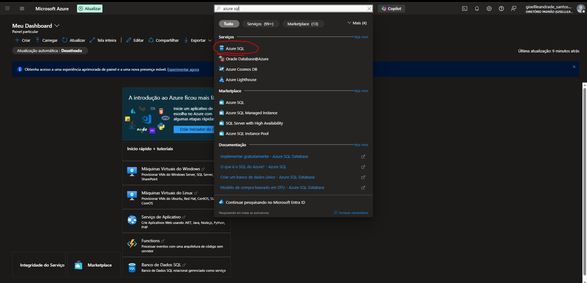
4. Selecione **"Instância Gerenciada de SQL do Azure e clique mostrar opções"**
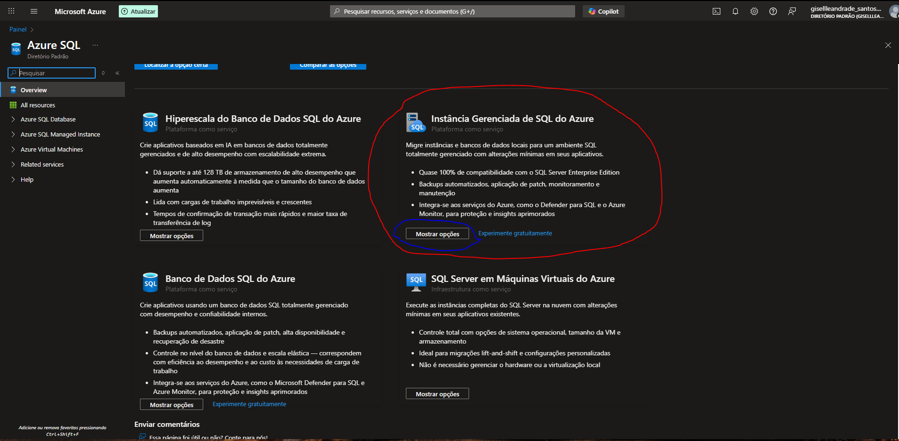

---

### **2️⃣ Criando a Instância Gerenciada**

1. Depois se clica em:  **"Criar uma Instância Gerenciada de SQL"**
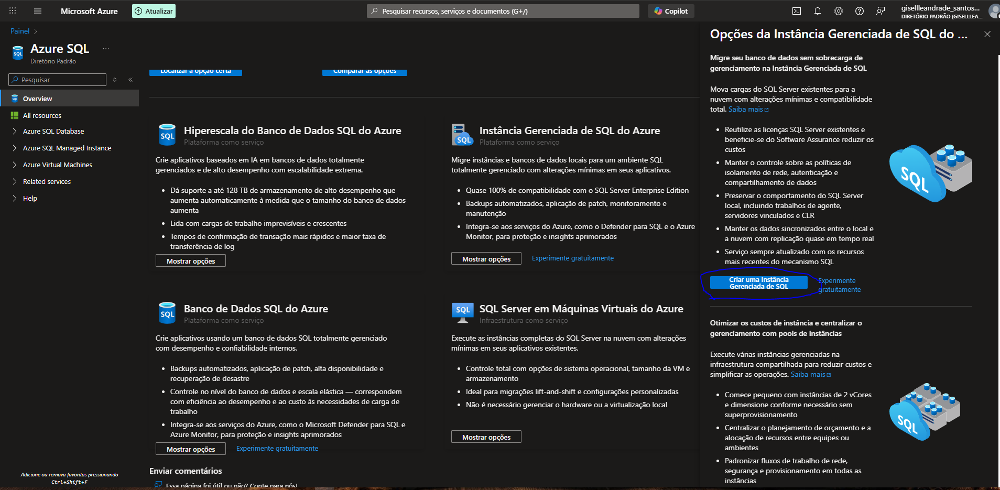

#### **Aba: Básico**

**Detalhes do Projeto:**
- **Assinatura**: Azure subscription 1
- **Grupo de recursos**: Dio-LAB06 *(ou criar novo)*

**Detalhes da Instância Gerenciada:**
- **Nome da instância**: `sant09s` *(escolha um nome único)*
- **Região**: `(Asia Pacific) Australia East` ou `West US 2`
- **Pertence a um pool de instâncias**: Não
- **Pool de instâncias**: Selecionar um pool de instâncias

**Computação + Armazenamento:**
- **Tipo**: Uso Geral
- **Série**: Standard (Geração 5)
- **vCores**: 8 vCores
- **Storage**: 256 GB
- **Armazenamento de backup**: Com redundância geográfica

> 💡 **Dica**: Você pode configurar a instância clicando em "Configurar a instância Gerenciada"

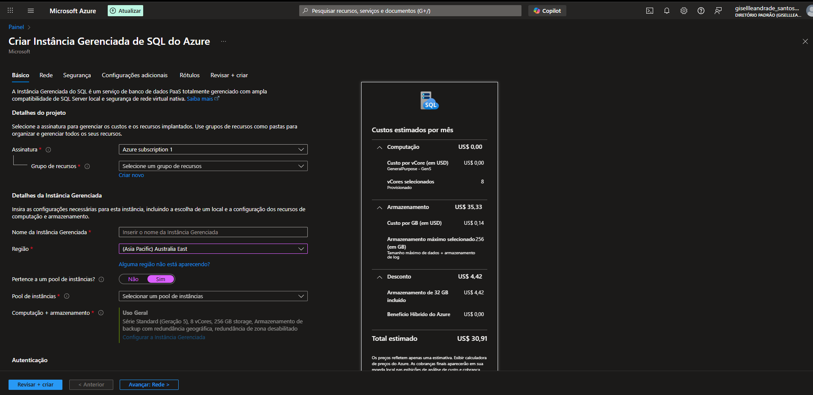
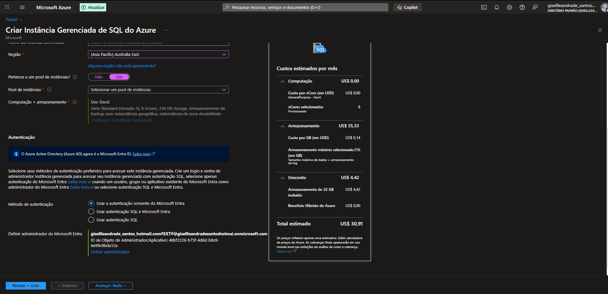

---

#### **Aba: Rede**

**Rede Virtual:**
- **Opção**: Criar nova rede virtual *(será criada automaticamente)*
- **Sub-rede/Rede virtual**: A rede `vnet-sant09s/ManagedInstance` será criada
- **Tipo de conexão**: Proxy (PaaS)
- **Ponto de extremidade público**: Desabilitado
- **Versão mínima do TLS**: 1.2

> ⚠️ **Importante**: A nova rede virtual será criada com uma única (padrão) sub-rede. A configuração de rede necessária para a Instância Gerenciada será automaticamente aplicada à sub-rede.

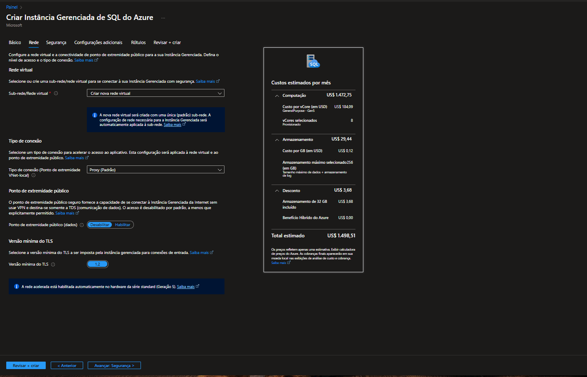

---

#### **Aba: Segurança**

**Autenticação:**
- **Método de autenticação**: ☑️ Usar autenticação somente do Microsoft Entra
- **Definir administrador do Microsoft Entra**: `gisellleandrade_santos_hotmail.com#EXT#...`
- **ID de Objeto do Administrador/Aplicativo**: `48bf2226-b75f-4d6d-b8c8-...`

**Microsoft Defender para SQL:**
- **Habilitar o Microsoft Defender para SQL**: ⭕ Agora não
  - *Período de avaliação gratuita de 30 dias disponível*
  - *Custo após trial: 15 USD/servidor/mês*

**Identidade:**
- **Identidade**: Identidade atribuída pelo sistema habilitada
- **Diretor de serviço**: Desativado

**Transparent Data Encryption:**
- **Transparent Data Encryption (TDE)**: Chave gerenciada por serviço selecionada
  - *Criptografa seus bancos de dados, backups e logs em repouso*

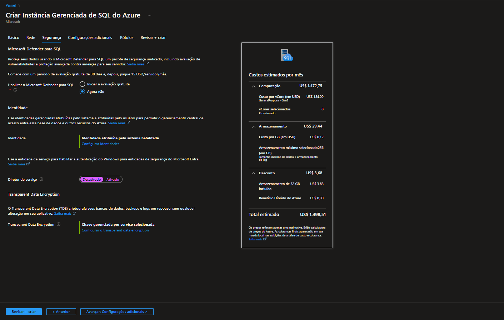

---

#### **Aba: Configurações Adicionais**

**Ordenação:**
- **Ordenação**: `SQL_Latin1_General_CP1_CI_AS`
  - Define regras de classificação e comparação de dados

**Fuso Horário:**
- **Fuso horário**: `(UTC) Coordinated Universal Time`
  - Aplicado a todos os bancos de dados criados nesta instância

**Replicação Geográfica:**
- **Usar como secundário de failover**: ⭕ Não
  - Para instâncias secundárias, selecione "Sim"

**Janela de Manutenção:**
- **Janela de manutenção**: Padrão do sistema (17h às 8h)
  - Período preferencial para manutenções do sistema

**Atualizações do Mecanismo de SQL:**
- **Política de atualização**: ⭕ SQL Server 2022
  - Mantém compatibilidade com versão mais recente do SQL Server

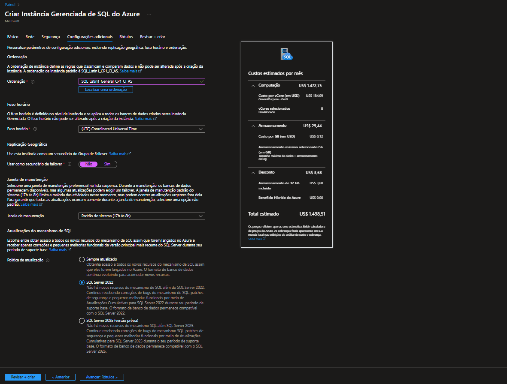

---

#### **Aba: Rótulos (Tags)**

Configure tags para organização e faturamento:
- Exemplo: `Environment: Lab`, `Project: DIO-Challenge`

---

### **3️⃣ Revisão e Criação**

1. Clique em **"Revisar + criar"**
2. Aguarde a validação passar
3. Revise o resumo de custos estimados:
   - **Computação**: US$ 1.472,75/mês
   - **Armazenamento**: US$ 29,44/mês
   - **Desconto**: US$ 3,68/mês (32 GB incluído)
   - **Total estimado**: US$ 1.498,51/mês

4. Clique em **"Criar"**

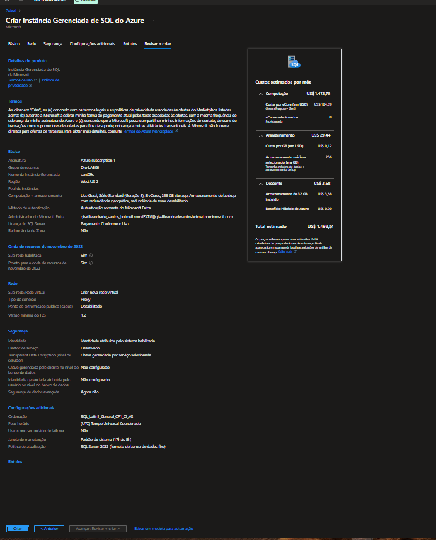

---

### **4️⃣ Aguardando a Implantação**

- ⏳ O processo de criação pode levar alguns minutos
- Você verá a tela de implantação em andamento
- Acompanhe pelo painel de notificações

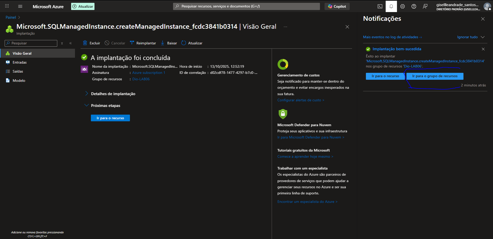

---

### **5️⃣ Implantação Concluída**

✅ **A implantação foi concluída**

**Informações da Implantação:**
- **Nome da implantação**: Microsoft.SQLManagedInstance.createManagedInstance_fcdc3841b0314
- **Hora de início**: 13/10/2025, 12:52:19
- **Assinatura**: Azure subscription 1
- **ID de correlação**: d02cdf78-1477-4297-b7d0-...
- **Grupo de recursos**: Dio-LAB06

**Próximas etapas:**
- Clique em **"Ir para o recurso"** para acessar a instância


---

### **6️⃣ Recursos Criados Automaticamente**

Após a implantação, os seguintes recursos foram criados no grupo de recursos **Dio-LAB06**:

| Nome | Tipo | Localização |
|------|------|-------------|
| `nsg-sant09s` | Grupo de segurança de rede | West US 2 |
| `rt-sant09s` | Tabela de roteamento | West US 2 |
| `sant09s` | Instância Gerenciada de SQL | West US 2 |
| `VirtualCluster...` | Cluster virtual | West US 2 |
| `vnet-sant09s` | Rede virtual | West US 2 |

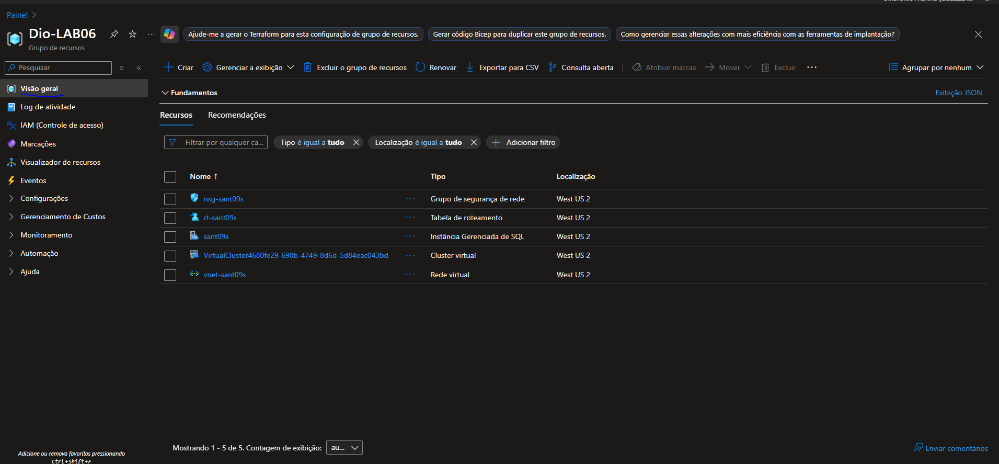

---

### **7️⃣ Acessando a Instância**

**Visão Geral da Instância:**

**Fundamentos:**
- **Grupo de recursos**: dio-lab06
- **Status**: Online ✅
- **Local**: West US 2
- **Assinatura**: Azure subscription 1
- **ID da Assinatura**: 4aec4f10-c017-44a7-ab0d-cdb21a94c919
- **Data de criação**: 2025-10-13 15:52 (UTC)

**Informações de Conexão:**
- **Administrador da instância**: CloudSAd324B606
- **Host**: `sant09s.e9247009a741.database.windows.net`
- **Camada de preços**: Uso Geral Série Standard (Geração 5) 8 vCores, 256 GB storage
- **Pool de instâncias**: Não está em um pool de instâncias
- **Sub-rede/Rede virtual**: vnet-sant09s/ManagedInstance
- **Cluster virtual**: VirtualCluster4680fe29-690b-4749-8d6d-5d84eac043bd

**Banco de dados da instância gerenciada:**
- 0 banco de dados de instância gerenciada

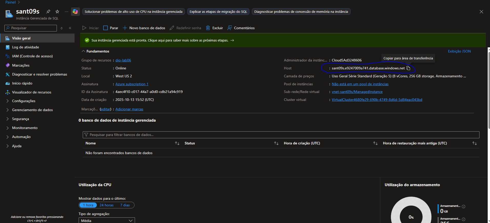

---

### **8️⃣ Configuração de Rotas**

A tabela de roteamento **rt-sant09s** foi criada com as seguintes rotas:

| Nome | Prefixo de endereço | Tipo do próximo salto | Endereço IP do próximo salto |
|------|---------------------|----------------------|------------------------------|
| Microsoft.Sql-managedInstances_UseOnly_subnet-10-0-... | 10.0.0.0/24 | VnetLocal | - |
| Microsoft.Sql-managedInstances_UseOnly_mi-AzureActiveDirectory | AzureActiveDirectory | Internet | - |
| Microsoft.Sql-managedInstances_UseOnly_mi-OneDsCollector | OneDsCollector | Internet | - |
| Microsoft.Sql-managedInstances_UseOnly_mi-Storage.westus2 | Storage.westus2 | Internet | - |
| Microsoft.Sql-managedInstances_UseOnly_mi-Storage.westcentralus | Storage.westcentralus | Internet | - |
| Microsoft.Sql-managedInstances_UseOnly_optional-AzureCloud.westus2 | AzureCloud.westus2 | Internet | - |
| Microsoft.Sql-managedInstances_UseOnly_optional-AzureCloud.westcentralus | AzureCloud.westcentralus | Internet | - |

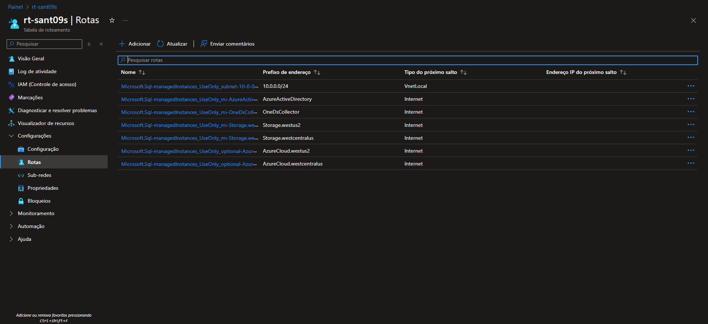

---

## 💰 Gerenciamento de Custos

### **Estimativa de Custos Mensais**

| Item | Valor (USD) |
|------|-------------|
| Computação (8 vCores) | $1.472,75 |
| Armazenamento (256 GB) | $29,44 |
| Desconto (32 GB incluído) | -$3,68 |
| **Total Estimado** | **$1.498,51/mês** |

> ⚠️ **Atenção**: Lembre-se de **parar ou excluir** a instância após os testes para evitar cobranças desnecessárias!

### **Como Reduzir Custos:**
- 🔹 Utilize o tier "Uso Geral" ao invés de "Crítico para os Negócios"
- 🔹 Reduza o número de vCores conforme necessário
- 🔹 Configure janelas de manutenção fora do horário comercial
- 🔹 Monitore o uso através do Azure Cost Management

---

## 🔒 Segurança e Melhores Práticas

### ✅ Implementadas Neste Projeto:

1. **Autenticação Microsoft Entra** (Azure AD)
2. **Transparent Data Encryption (TDE)** habilitado
3. **Versão mínima TLS 1.2**
4. **Network Security Groups (NSG)** configurados automaticamente
5. **Isolamento de rede** através de Virtual Network

### 🛡️ Recomendações Adicionais:

- [ ] Habilitar Microsoft Defender para SQL (após período trial)
- [ ] Configurar backups de longo prazo
- [ ] Implementar alertas de monitoramento
- [ ] Configurar Private Endpoint para acesso mais seguro
- [ ] Revisar e ajustar regras de firewall
- [ ] Implementar auditoria de banco de dados

---

## 📊 Monitoramento da Instância

Após a criação, você pode monitorar:

- **Utilização de CPU**: Atualmente em 0%
- **Utilização de Armazenamento**: 0 GB / 256 GB
- **Conexões ativas**
- **Logs de atividade**
- **Métricas de desempenho**

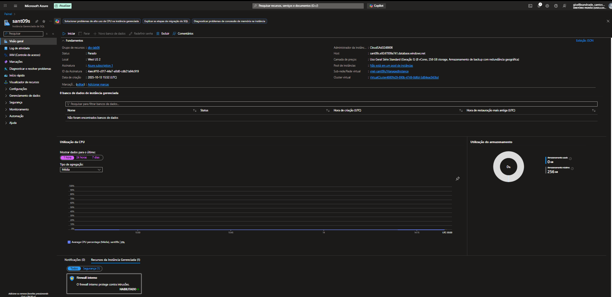

---

## 🗄️ Criando um Banco de Dados

Após a instância estar online, você pode criar bancos de dados nela:

### **Passo 1: Acessar a criação de banco de dados**

1. No portal Azure, busque por **"Banco de dados gerenciados do SQL do Azure"**
2. Clique em **"+ Criar"** ou acesse através da instância gerenciada

### **Passo 2: Configurar o banco de dados**

**Detalhes do Projeto:**
- **Assinatura**: Azure subscription 1
- **Grupo de recursos**: Dio-LAB06 *(mesmo da instância)*

**Detalhes do Banco de Dados:**
- **Nome do banco de dados**: *(Insira o nome do banco de dados)*
  - Exemplo: `database_production`, `database_test`, etc.
- **Instância gerenciada**: `sant09s (westus2)`
  - Selecione a instância criada anteriormente

### **Passo 3: Criar o banco**

1. Clique em **"Revisar + criar"**
2. Aguarde a validação
3. Clique em **"Criar"**

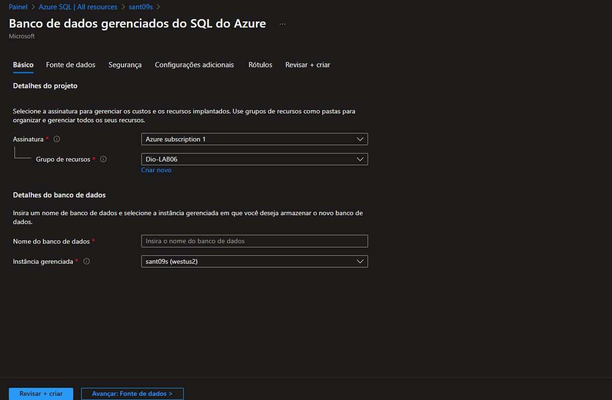

> 💡 **Dica**: Você pode criar múltiplos bancos de dados na mesma instância gerenciada sem custos adicionais de computação. Você pagará apenas pelo armazenamento adicional utilizado.

---

## 🧪 Testando a Conexão

### **Via Azure Data Studio ou SQL Server Management Studio (SSMS):**

```plaintext
Server: sant09s.e9247009a741.database.windows.net
Authentication: Azure Active Directory - Universal with MFA
Database: <seu_banco>
```

### **String de Conexão:**

```csharp
Server=tcp:sant09s.e9247009a741.database.windows.net,1433;
Initial Catalog=<seu_banco>;
Persist Security Info=False;
MultipleActiveResultSets=False;
Encrypt=True;
TrustServerCertificate=False;
Authentication="Active Directory Interactive";
```

---

## 🚨 Troubleshooting

### **Problema: Não consigo conectar à instância**
✅ **Solução**: 
- Verifique as regras de firewall no NSG
- Confirme que o ponto de extremidade público está habilitado (se necessário)
- Verifique se você tem permissões adequadas no Azure AD

### **Problema: Implantação falhou**
✅ **Solução**: 
- Verifique os logs de atividade
- Confirme se há recursos suficientes na assinatura
- Verifique se o nome da instância é único

### **Problema: Custos elevados**
✅ **Solução**: 
- Reduza vCores ou mude para tier inferior
- Exclua a instância quando não estiver usando
- Configure alertas de orçamento no Azure

---

## 🧹 Limpeza de Recursos

Para evitar cobranças, exclua os recursos após o uso:

1. Acesse o **Grupo de Recursos** `Dio-LAB06`
2. Clique em **"Excluir grupo de recursos"**
3. Digite o nome do grupo para confirmar
4. Clique em **"Excluir"**

> ⚠️ Esta ação **não pode ser desfeita** e removerá todos os recursos!

---

## 📚 Recursos Adicionais

### Documentação Oficial:
- [Instância Gerenciada de SQL do Azure - Microsoft Learn](https://learn.microsoft.com/pt-br/azure/azure-sql/managed-instance/)
- [Guia de início rápido](https://learn.microsoft.com/pt-br/azure/azure-sql/managed-instance/instance-create-quickstart)
- [Calculadora de Preços do Azure](https://azure.microsoft.com/pt-br/pricing/calculator/)

### Tutoriais:
- [Migrar SQL Server para Instância Gerenciada](https://learn.microsoft.com/pt-br/azure/azure-sql/migration-guides/)
- [Configurar rede para Instância Gerenciada](https://learn.microsoft.com/pt-br/azure/azure-sql/managed-instance/connectivity-architecture-overview)

---

## 🎓 Aprendizados

Durante este laboratório, aprendi:

✅ Como provisionar uma Instância Gerenciada de SQL no Azure  
✅ Configurar rede virtual e segurança para banco de dados PaaS  
✅ Entender a diferença entre Instância Gerenciada e Banco SQL do Azure  
✅ Gerenciar custos e monitorar recursos no Azure  
✅ Aplicar melhores práticas de segurança em ambientes cloud  

---

## 👤 Autor

**Giselle Andrade Santos**
- 🎓 Aluna DIO - Digital Innovation One
- 📧 Email: gisellleandrade_santos@hotmail.com
- 💼 LinkedIn: [[link](https://www.linkedin.com/in/giselle-santos-21ab221b6/)]

---

## 📝 Licença

Este projeto é de uso educacional e faz parte dos desafios propostos pela DIO.

---

## ⭐ Agradecimentos

- **DIO (Digital Innovation One)** pela oportunidade de aprendizado
- **Microsoft Azure** pela plataforma e documentação
- Comunidade tech pelo suporte e compartilhamento de conhecimento

---

**📅 Data de Conclusão**: 13 de Outubro de 2025

**🏆 Status do Desafio**: ✅ Concluído com Sucesso

---

<div align="center">
  
### 💙 Se este repositório foi útil para você, considere dar uma ⭐!

**Feito com 💙 durante o bootcamp DIO**

</div>