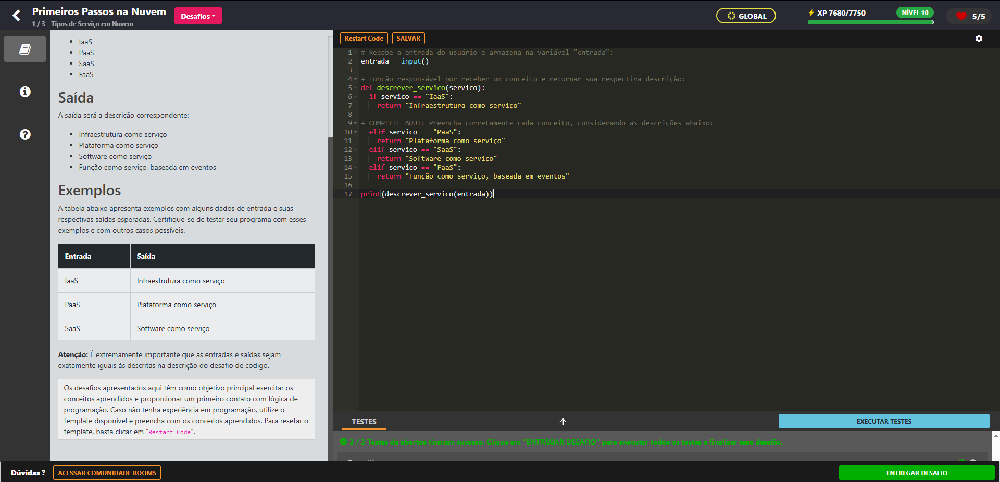
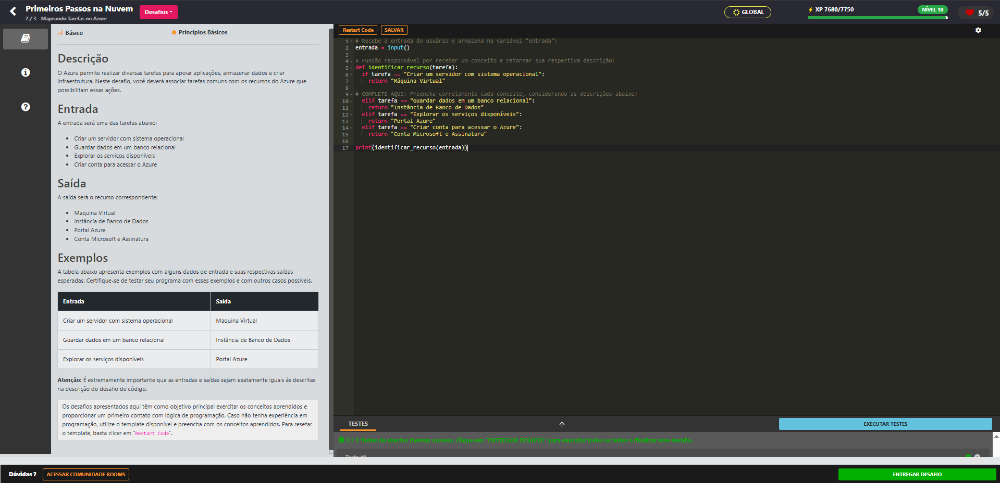

# 🚀 Desafios de Código - Primeiros Passos na Nuvem Azure

Este repositório contém as soluções dos desafios de código do módulo "Primeiros Passos na Nuvem" do curso de Azure. Os desafios têm como objetivo exercitar conceitos fundamentais sobre serviços e recursos da plataforma Azure utilizando Python.

## 📋 Sobre o Projeto

O projeto consiste em três desafios práticos que abordam:

- Tipos de Serviço em Nuvem (IaaS, PaaS, SaaS, FaaS)
- Recursos e Tarefas Comuns no Azure
- Benefícios da Computação em Nuvem

## 🎯 Desafios

### Desafio 1: Tipos de Serviço em Nuvem

**Objetivo:** Relacionar cada tipo de serviço do Azure com sua descrição correspondente.

**Entradas possíveis:**

- IaaS
- PaaS
- SaaS
- FaaS

**Saídas esperadas:**

- Infraestrutura como serviço
- Plataforma como serviço
- Software como serviço
- Função como serviço, baseada em eventos

#### 💻 Solução — Desafio 1

```python
# Recebe a entrada do usuário e armazena na variável "entrada":
entrada = input()

# Função responsável por receber um conceito e retornar sua respectiva descrição:
def descrever_servico(servico):
    if servico == "IaaS":
        return "Infraestrutura como serviço"
    
    elif servico == "PaaS":
        return "Plataforma como serviço"
    
    elif servico == "SaaS":
        return "Software como serviço"
    
    elif servico == "FaaS":
        return "Função como serviço, baseada em eventos"

print(descrever_servico(entrada))
```

Resultado do laboratório:


---

### Desafio 2: Mapeando Tarefas no Azure

**Objetivo:** Associar tarefas comuns com os recursos do Azure que possibilitam essas ações.

**Entradas possíveis:**

- Criar um servidor com sistema operacional
- Guardar dados em um banco relacional
- Explorar os serviços disponíveis
- Criar conta para acessar o Azure

**Saídas esperadas:**

- Maquina Virtual
- Instância de Banco de Dados
- Portal Azure
- Conta Microsoft e Assinatura

#### 💻 Solução — Desafio 2

```python
# Recebe a entrada do usuário e armazena na variável "entrada":
entrada = input()

# Função responsável por receber um conceito e retornar sua respectiva descrição:
def identificar_recurso(tarefa):
    if tarefa == "Criar um servidor com sistema operacional":
        return "Maquina Virtual"
    
    elif tarefa == "Guardar dados em um banco relacional":
        return "Instância de Banco de Dados"
    
    elif tarefa == "Explorar os serviços disponíveis":
        return "Portal Azure"
    
    elif tarefa == "Criar conta para acessar o Azure":
        return "Conta Microsoft e Assinatura"

print(identificar_recurso(entrada))
```

Resultado do laboratorio:



---

### Desafio 3: Benefícios da Computação em Nuvem

**Objetivo:** Relacionar diferentes benefícios da computação em nuvem com suas características.

**Entradas possíveis:**

- Escalabilidade
- Alta Disponibilidade
- Custo sob demanda
- Acesso global

**Saídas esperadas:**

- Cresce ou reduz conforme necessidade
- Disponível quase sempre
- Paga apenas pelo que usar
- Acesso de qualquer lugar

#### 💻 Solução — Desafio 3

```python
# Recebe a entrada do usuário e armazena na variável "entrada":
entrada = input()

# Função responsável por receber um conceito e retornar sua respectiva descrição:
def descrever_beneficio(beneficio):
    if beneficio == "Escalabilidade":
        return "Cresce ou reduz conforme necessidade"
    
    elif beneficio == "Alta Disponibilidade":
        return "Disponível quase sempre"
    
    elif beneficio == "Custo sob demanda":
        return "Paga apenas pelo que usar"
    
    elif beneficio == "Acesso global":
        return "Acesso de qualquer lugar"

print(descrever_beneficio(entrada))
```

Resultado do laboratorio:


---

## 🛠️ Tecnologias Utilizadas

- **Linguagem:** Python 3.x
- **Plataforma:** Azure
- **Ambiente:** Plataforma de desafios DIO (Digital Innovation One)

## 📝 Como Executar

1. Clone este repositório:

```bash
git clone https://github.com/seu-usuario/desafios-azure.git
```

2.Navegue até o diretório do projeto:

```bash
cd desafios-azure
```

3.Execute qualquer um dos desafios:

```bash
python desafio1.py
python desafio2.py
python desafio3.py
```

4.Digite a entrada quando solicitado e veja o resultado!

## ⚠️ Observações Importantes

- As entradas e saídas devem ser **exatamente** iguais às descritas nos desafios
- Atenção especial para:
  - Acentuação (ou falta dela)
  - Letras maiúsculas e minúsculas
  - Espaços em branco
- Exemplo: "Maquina Virtual" (sem acento) ao invés de "Máquina Virtual"

## 📚 Conceitos Aprendidos

- **IaaS (Infrastructure as a Service):** Fornece infraestrutura de TI virtualizada
- **PaaS (Platform as a Service):** Plataforma completa para desenvolvimento
- **SaaS (Software as a Service):** Software pronto para uso via internet
- **FaaS (Function as a Service):** Execução de código baseada em eventos
- **Máquinas Virtuais:** Servidores virtualizados na nuvem
- **Bancos de Dados:** Armazenamento gerenciado de dados
- **Portal Azure:** Interface web para gerenciar recursos
- **Escalabilidade:** Capacidade de crescer ou diminuir recursos conforme demanda

## 🎓 Sobre o Curso

Este projeto faz parte do curso de Azure oferecido pela plataforma DIO (Digital Innovation One), focado em ensinar os fundamentos da computação em nuvem e os principais serviços da Microsoft Azure.

## 👤 Autor

Desenvolvido durante o aprendizado do curso de Azure.

## 📄 Licença

Este projeto está sob a licença MIT. Sinta-se livre para usar e modificar conforme necessário.

---

⭐ Se este repositório foi útil para você, considere dar uma estrela!

💡 Dúvidas ou sugestões? Abra uma issue!
